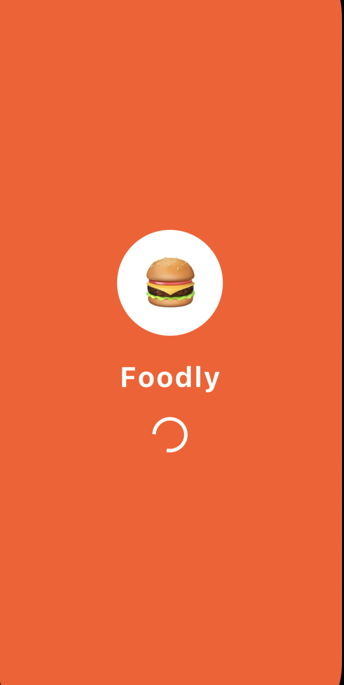
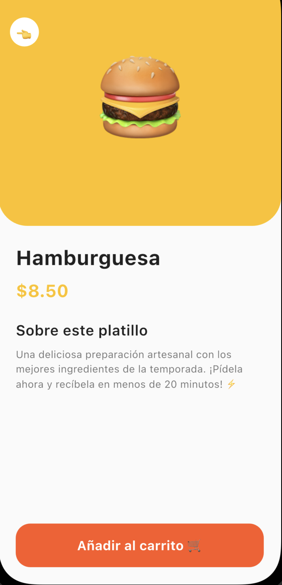

# 🍔 Foodly - Figma to Flutter 

**Foodly** es una aplicación móvil de delivery de comida construida con Flutter. Este proyecto demuestra la implementación técnica de un prototipo de alta fidelidad, respetando Design Tokens, sistemas de rejilla y una arquitectura de componentes escalable.

---

## 📸 Capturas de Pantalla

A continuación, se muestra la implementación de las tres pantallas principales.

| 1. Splash Screen | 2. Home Screen | 3. Product Detail |
| :---: | :---: | :---: |
|  |  |  |
| *Branding y carga inicial* | *Categorías y Populares* | *Información y compra* |


---

## 🎨 Especificaciones de Diseño (Tokens)

La consistencia visual se mantiene mediante el uso de tokens centralizados en `lib/theme/app_theme.dart`.

### Paleta de Colores (Emerald Fresh)

* **Primary:** #FF5722 (Naranja Vibrante) - Utilizado en branding, botones y elementos de acción.
* **Secondary:** #FFC107 (Ámbar) - Utilizado para precios y acentos visuales.
* **Background:** #FAFAFA (Gris Ultra Claro) - Fondo de la aplicación para mayor legibilidad.
* **Text Dark:** #212121 (Casi Negro) - Jerarquía principal y títulos.
* **ext Light:** #757575 (Gris Medio) - Descripciones y texto secundario.


### Tipografía & Grid
* **Fuente:** Inter (implementada con jerarquías Bold, SemiBold y Regular).
* **8-pt Grid System:** Todo el espaciado (padding/margin) se basa en múltiplos de 8 (4, 8, 16, 24, 32).

---

## ✨ Características Implementadas

1. **Splash Screen:** Transición automática tras 2.5 segundos con branding circular.
2. **Sistema de Categorías:** Lista horizontal interactiva que cambia de estado (color y sombra) al ser seleccionada.
3. **Buscador Moderno:** Input estilizado con iconografía basada en emojis.
4. **Lista de Productos:** Componente reutilizable `_ProductCard` con gestión de sombras y bordes redondeados.
5. **Navegación Dinámica:** Paso de argumentos mediante rutas para la visualización de detalles del producto.
6. **Defensa de Datos:** Implementación de Null Safety y conversiones seguras de tipo (`toString()` y `??`) para evitar errores en tiempo de ejecución.

---

## 📁 Estructura del Proyecto

```text
lib/
├── main.dart                 # Configuración de rutas y tema global.
├── theme/
│   └── app_theme.dart        # Design Tokens (Colores, Spacing, Estilos).
└── screens/
    ├── splash_screen.dart    # Lógica de entrada.
    ├── home_screen.dart      # Dashboard con filtros y productos.
    └── product_detail_screen.dart # Detalle y acción de compra.
```

## 🚀 Instalación y Uso

Sigue estos pasos para poner en marcha el proyecto en tu entorno local:

1. **Clonar el repositorio:**
   ```bash
   git clone [https://github.com/Junse99/final-project.git](https://github.com/Junse99/final-project.git)
   ```

2. **Clonar el repositorio:**
  Ejecuta este comando en la raíz del proyecto para descargar los paquetes necesarios:
  
   ```bash
   flutter pub get
   ```

3. **Ejecutar la aplicación:**
  Asegúrate de tener un emulador abierto o un dispositivo conectado y lanza el proyecto:

   ```bash
   flutter pub get
   ```